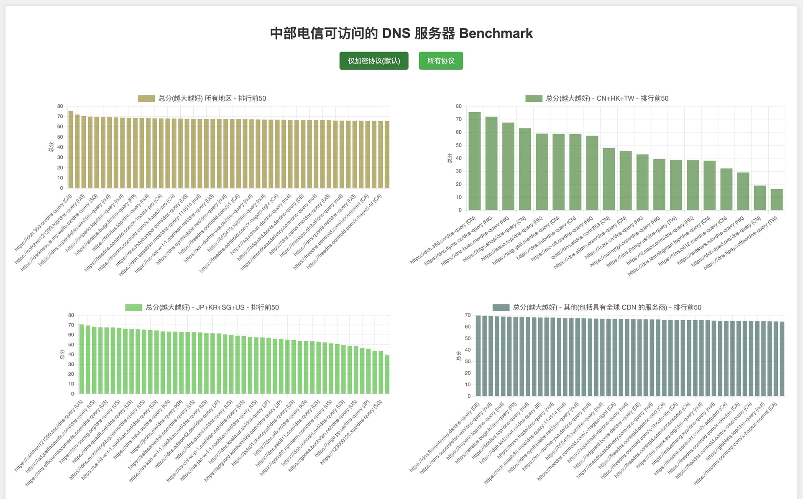

我测了全世界...的 DNS 服务器

# 测试全世界的 DNS 服务器能否访问及性能 - 超级多

如题，测试全世界的 DNS 服务器能否访问及性能，一共有 `989` 个 DNS 服务器地址，列表在 `providers.txt` 文件中（包括同一个服务的 UDP、DoH、DoT 地址）。测了 3 个小时，终于测完了。

中部电信，Wi-Fi6E 环境，macOS 14.5，每个服务器测 10 秒。
话不多说，直接上结果。

## 测试结果

> 可点击柱状图的每个柱子复制对应 DNS 服务器地址
>
> 标题下按钮可切换数据源，有
> - `加密 DNS 服务器（DoH、DoT、QUIC）`（默认展示类型）
> - `所有 DNS 服务器数据（加密 DNS 服务器 + IPv4、IPv6 非加密服务器）`
> 

[数据页面](https://xxnuo.github.io/dns-benchmark/results.html)

[数据页面(国内镜像)](https://dns-benchmark.gh.2020818.xyz/results.html)

## 测试结果预览图



具体项目去数据页面看吧！

## 自测方法

> Github 仓库 [dns-benchmark](https://github.com/xxnuo/dns-benchmark/)

首先关闭所有代理软件的 Tun 模式、虚拟网卡模式，否则会影响测试结果。

### 安装必须软件包[按需执行]

```bash
brew tap tantalor93/dnspyre
brew install dnspyre jq python3 git
pip3 install -U geoip2
```

### DNS 服务器地址列表来源[可直接用本仓库的 providers.txt]

Github 项目：

```
KnowledgeBaseDNS/docs/general/dns-providers.md
curl.wiki/DNS-over-HTTPS.md
```

`providers.txt` 提取方法：

```
Cursor Chat 选择文件，输入提示: "按顺序提取所有的 dns 到代码段中，一行一个"
然后不停提示`继续`，直到完全提取所有条目，复制粘贴到 providers-raw.txt 文件中。
用 Excel 的数据菜单里的删除重复项功能去重，保存为 providers.txt
```

得到 `989` 个 DNS 服务器地址（包括同一个服务的 UDP、DoH、DoT 地址）。

### macOS 测试过程

开始前保证已经安装了必须软件包：`git dnspyre jq python3:geoip2`。

```bash
# 下载本仓库
git clone https://github.com/xxnuo/dns-benchmark.git
cd dns-benchmark
chmod +x bench.sh
unset HTTPS_PROXY HTTP_PROXY ALL_PROXY
unset https_proxy http_proxy all_proxy
# 运行测试
./bench.sh
# 保存结果
cp results-<你的文件日期>.json results.json
# 分离国内和国外数据得到 results-with-geo.json
python3 provider-domains-sort.py results.json
cp results.json results.json.bak
mv results-with-geo.json results.json
# 根据算法给每个结果打总分
python3 provider-domains-score.py results.json
cp results.json results.json.bak2
mv results-with-score.json results.json
# 生成图表
chmod +x graph.sh
./graph.sh results.json
```

得到 `results.html` 文件，会自动用浏览器打开。

Done!
